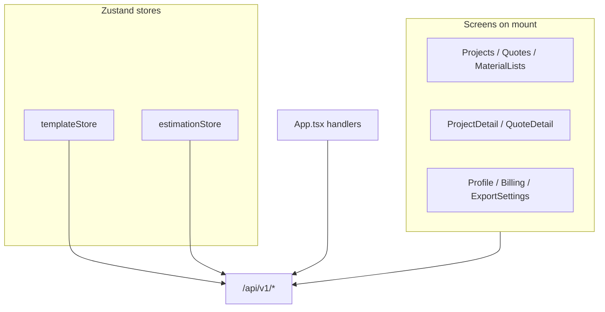
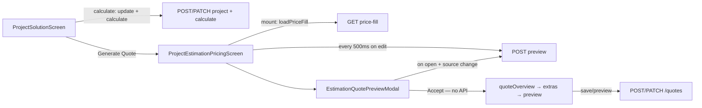

# API Call & Performance Optimization Audit

## Current architecture

The app uses a **single Axios client** ([`src/services/api/apiClient.ts`](src/services/api/apiClient.ts)) with auth interceptors and token-refresh queuing. There is **no HTTP caching**, **no TanStack Query/SWR**, and **no request deduplication** at the service layer.

Data fetching is split inconsistently:
- **2 stores fetch APIs:** [`templateStore.ts`](src/stores/templateStore.ts), [`estimationStore.ts`](src/stores/estimationStore.ts)
- **Everything else** fetches directly from components or [`App.tsx`](src/app/App.tsx)

Navigation is view-based (not React Router): switching views **unmounts** the previous screen, so mount-time `useEffect` fetches run again on every visit.



---

## Critical issues (highest API waste)

### 1. Material list screen: N+1 requests

**File:** [`src/components/features/material-lists/MaterialListScreen.tsx`](src/components/features/material-lists/MaterialListScreen.tsx) (lines 84–123)

**Behavior:** On every mount / `refreshTrigger` change:
1. `projectsService.list(1, 100)`
2. For each calculated project → `materialListsService.getByProject(project.id)`

**Impact:** 20 calculated projects = **21 HTTP requests** per visit.

**Suggested fix:**
- **Backend (best):** Add `GET /api/v1/material-lists` (paginated list with project metadata).
- **Frontend interim:** Cache project list + material lists in a small store with TTL; only refetch changed projects after create/delete.
- **Partial:** If backend cannot add list endpoint, at least cap concurrency (e.g. batch of 5) to avoid thundering herd.

---

### 2. Material catalog fetched 2–3× per Export Settings visit

**Files:**
- [`MaterialPricesSection.tsx`](src/components/features/prebuilt-templates/MaterialPricesSection.tsx) lines 56–71 — direct `estimationService.getMaterialCatalog()` on mount
- [`templateStore.ts`](src/stores/templateStore.ts) lines 632–635 — `loadMaterialPrices` **always** fetches full catalog (ignores `search`/`category` params)
- Debounced search (lines 73–83) re-triggers `loadMaterialPrices` every 300ms after typing

**Impact:** Opening Material Prices tab → **1 catalog + 1 prices** immediately, then **catalog + prices again** on first `loadMaterialPrices`. Each keystroke → **another catalog + prices** pair. Catalog is large and static; prices are the only thing that should filter.

**Suggested fix:**
- Cache catalog once in `templateStore` (or shared `catalogCache` with `loadedAt` / TTL).
- Remove component-level `loadCatalog()`; read catalog from store.
- In `loadMaterialPrices`, only call `templatesService.getMaterialPrices(params)` — use cached catalog for enrichment.
- Pass `search`/`category` to catalog API only if server-side filtering is required for huge catalogs; otherwise filter client-side in `SearchableMaterialSelect` (already does local filter).

---

### 3. ~~Double `loadPriceFill` after project calculate~~ (resolved — new risk elsewhere)

**Was:** `ProjectSolutionScreen` called `bootstrapEstimation` twice.

**Now:** Estimation moved to [`ProjectEstimationPricingScreen`](src/components/features/projects/ProjectEstimationPricingScreen.tsx). Single `loadPriceFill` on mount — **but** unstable `previousData` in effect deps may re-trigger bootstrap. **New dominant issue:** debounced auto-preview (see Second pass §1).

---

### 4. Duplicate `projectsService.getById` + transform in App.tsx

**File:** [`App.tsx`](src/app/App.tsx) — same ~100-line transform block at lines **348**, **448**, **501**, **554**

**Handlers:** `handleProjectCalculate`, `handleViewResults`, `handleModifyDimensionsRecalculate`, `handleAddDimensions`

**Impact:** User flow detail → view results → modify can trigger **3–4 identical `getById` calls** even though `ProjectDetailScreen` already fetched the project.

**Suggested fix:**
- Extract `hydrateProjectFlow(projectId)` helper (fetch + transform once).
- Pass hydrated data from `ProjectDetailScreen` via App state, or cache in a lightweight `projectCacheStore` keyed by `projectId` with invalidation on update/delete.
- For `handleViewResults`, prefer passing `lastCalculationResult` from detail response (already partially done via `initialCalculationResult`).

---

## High issues

### 5. `loadMaterialPrices` auto-sync fan-out

**File:** [`templateStore.ts`](src/stores/templateStore.ts) lines 640–655

On load, rows missing `itemKey` trigger `Promise.allSettled` of individual `updateMaterialPrice` PATCH calls.

**Impact:** First visit with legacy rows → **N write requests** after every price load.

**Suggested fix:** Batch sync endpoint on backend, or run sync once per session (flag in store), or defer sync to explicit user action.

---

### 6. `ProjectsScreen` forced remount refetch

**File:** [`App.tsx`](src/app/App.tsx) line 1723 — `key={refreshProjects}`

Unlike `QuotesScreen` / `MaterialListScreen` which use `refreshTrigger`, projects list **fully remounts** on refresh, guaranteeing a new mount `useEffect` fetch.

**Suggested fix:** Replace `key={refreshProjects}` with `refreshTrigger={refreshProjects}` prop (same pattern as quotes).

---

### 7. No in-flight / stale guards on store fetches

**Files:** [`templateStore.ts`](src/stores/templateStore.ts) (`loadTemplates`, `loadMaterialPrices`), [`estimationStore.ts`](src/stores/estimationStore.ts) (`loadPriceFill`, `preview`)

**Impact:** Rapid tab switches or double-clicks can race; last response wins, causing flicker and wasted calls.

**Suggested fix:** Add `inFlight` promise reuse or request sequence numbers (ignore stale responses). Pattern already used in `ProjectsScreen` via `requestInProgressRef` — extend to stores.

---

### 8. `loadTemplates()` on every Export Settings mount

**File:** [`ExportSettingsSection.tsx`](src/components/features/settings/ExportSettingsSection.tsx) line 22

Settings sections **unmount** when switching tabs ([`SettingsScreen.tsx`](src/components/features/SettingsScreen.tsx) lines 146–161), so revisiting Export Settings always refetches full template config.

**Suggested fix:** Load templates once per session in `templateStore` with `lastLoadedAt`; skip fetch if fresh. Or keep `ExportSettingsSection` mounted with `display: none` instead of conditional render.

**Note:** [`PreBuiltTemplatesScreen.tsx`](src/components/features/PreBuiltTemplatesScreen.tsx) duplicates this logic but is **not routed** in App — safe to delete or consolidate.

---

### 9. Estimation preview always on modal open

**File:** [`GenerateQuoteModal.tsx`](src/components/features/estimation/GenerateQuoteModal.tsx) lines 43–47

`preview(quoteSource)` runs whenever modal opens or quote source changes, even if `previewResult` in store is still valid.

**Impact:** Extra `POST /api/v1/estimation/preview` per modal open.

**Suggested fix:** Skip preview if `previewResult` exists and inputs unchanged (track `pricingInputs` / `quoteSettings` hash). Only auto-preview when stale; keep manual Refresh button.

---

## Medium issues

### 10. Duplicate entity fetches across screens

| Entity | Locations | Suggestion |
|--------|-----------|------------|
| Project `getById` | `ProjectDetailScreen`, `ProjectEditScreen`, 4× `App.tsx` | Shared cache or pass-through state |
| Quote `getById` | `QuoteDetailScreen`, `App.handleEditQuote` (~882) | Cache or pass quote from list/detail |
| `getProfile` | `ProfileScreen`, `QuoteExtrasNotesScreen` | Store bank details in `authStore` after first fetch |
| `getCurrent` subscription | `BillingScreen`, `SubscriptionPlansContent`, `PaymentCallbackScreen` | `subscriptionStore` with shared cache |

---

### 11. `QuoteExtrasNotesScreen` unstable effect dependencies

**File:** [`QuoteExtrasNotesScreen.tsx`](src/components/features/quotes/QuoteExtrasNotesScreen.tsx) line 123

Deps: `[user?.id, previousData, templatePaymentMethods, getDefaultPaymentMethod]`

`templatePaymentMethods` is a new array reference when `loadTemplates()` completes → effect re-runs → **`getProfile` again** and form fields reset.

**Suggested fix:** Depend only on `user?.id`; read template methods inside effect. Use `previousData?.extrasNotes` stable fields, not whole `previousData` object.

---

### 12. `ProfileScreen` fetch → store update → second effect

**File:** [`ProfileScreen.tsx`](src/components/features/ProfileScreen.tsx)

Mount fetch calls `updateUser()` then `setFormData()`. A second `useEffect` syncing `user` → form can overwrite in-progress edits.

**Suggested fix:** Single initialization path; avoid syncing store → form after mount unless explicit refresh.

---

### 13. `PaymentCallbackScreen` polling without cleanup

**File:** [`PaymentCallbackScreen.tsx`](src/components/features/PaymentCallbackScreen.tsx) lines 82–88

Production path: up to **10× `getCurrent`** every 2s via recursive `setTimeout`, no abort on unmount.

**Suggested fix:** `useRef` for timeout ID + `cancelled` flag in cleanup; consider exponential backoff.

---

### 14. `ProjectsScreen` AbortController not wired

**File:** [`ProjectsScreen.tsx`](src/components/features/projects/ProjectsScreen.tsx) lines 160–191

`AbortController` created but never passed to `projectsService.list()`. Stale responses possible if user navigates away quickly.

**Suggested fix:** Pass `signal` through service methods to Axios, or remove dead abort code.

---

### 15. List fetch strategy inconsistency

| Screen | Fetch | Search |
|--------|-------|--------|
| `ProjectsScreen` | `list(1, 50)` on mount | Client filter + optional server search on submit |
| `QuotesScreen` | `list(1, 100)` on mount | Client filter only |
| `MaterialListScreen` | `list(1, 100)` + N material lists | Client filter only |

**Impact:** Over-fetching fixed page sizes; quotes always pull 100 rows.

**Suggested fix:** Align on server-side pagination + search params; reduce default `limit` with "load more".

---

### 16. Project calculate on every solution mount

**File:** [`ProjectSolutionScreen.tsx`](src/components/features/projects/ProjectSolutionScreen.tsx) lines 354–373

Fresh calculate flow always runs `projectsService.update` + `calculate` on mount (deducts points). `initialCalculationResult` path skips calculate (good) but `view results` from App still re-fetches project in App before navigating.

**Suggested fix:** Never auto-calculate if project `status === 'calculated'` and stored result exists; require explicit "Recalculate" CTA.

---

## Lower priority / infrastructure

### 17. No data-fetching library

Adding **TanStack Query** would address most issues systematically:
- Automatic dedup, stale-while-revalidate, cache invalidation
- `queryKey` per `projectId`, `quoteId`, `material-catalog`
- Mutation hooks invalidate related queries

This is the largest structural improvement but higher effort than targeted fixes.

### 18. Service-layer gaps

- No Axios `timeout` configured
- No generic retry for 5xx/network (only 401 refresh)
- `ApiResponse<T>` duplicated across ~9 service files
- `templatesService` swallows errors → `null`/`[]` hides failures, may cause retry loops in UI

### 19. Dead / unused code

- [`calculationStore.ts`](src/stores/calculationStore.ts) exported but never imported
- [`PreBuiltTemplatesScreen.tsx`](src/components/features/PreBuiltTemplatesScreen.tsx) orphan duplicate of Export Settings

---

## Recommended implementation order

Phased approach — each phase is independently valuable:

**Phase 1 — Quick wins (1–2 days)**
1. Fix double `loadPriceFill` in `ProjectSolutionScreen`
2. Deduplicate material catalog (store cache, remove component fetch)
3. Stop refetching catalog inside `loadMaterialPrices`
4. Replace `key={refreshProjects}` with `refreshTrigger`
5. Add in-flight guards to `estimationStore` / `templateStore` fetch actions

**Phase 2 — Flow consolidation (2–3 days)**
6. Extract `hydrateProjectFlow` in App; reduce `getById` duplication
7. Fix `QuoteExtrasNotesScreen` effect deps
8. Skip stale `preview()` in `GenerateQuoteModal`
9. `loadTemplates` session cache + stable Export Settings mount

**Phase 3 — Structural (3–5 days)**
10. Backend batch material-lists endpoint (or frontend cache)
11. Introduce TanStack Query for list/detail endpoints
12. `subscriptionStore` / profile bank-details cache
13. Payment callback polling cleanup

**Phase 4 — Backend coordination**
14. Batch material-price `itemKey` sync endpoint
15. Paginated list APIs for projects/quotes/material-lists

---

## Files to touch (by priority)

| Priority | Files |
|----------|-------|
| Critical | `MaterialListScreen.tsx`, `MaterialPricesSection.tsx`, `templateStore.ts`, `ProjectSolutionScreen.tsx`, `App.tsx` |
| High | `ExportSettingsSection.tsx`, `GenerateQuoteModal.tsx`, `estimationStore.ts`, `ProjectsScreen.tsx` |
| Medium | `QuoteExtrasNotesScreen.tsx`, `ProfileScreen.tsx`, `BillingScreen.tsx`, `SubscriptionPlansContent.tsx`, `PaymentCallbackScreen.tsx`, `QuoteDetailScreen.tsx` |
| Infra | `apiClient.ts`, new `queryClient` setup, optional `projectCacheStore` |

---

## What is already done well

- `SearchableMaterialSelect` filters locally (no per-keystroke API)
- `ProjectsScreen` search is client-side by default; server search only on submit
- `ProjectSolutionScreen` uses refs to prevent duplicate calculate/save
- `MaterialPricesSection` debounces price search (300ms) — catalog should not participate
- `SubscriptionPlansContent` batches 3 calls with `Promise.all` (good pattern to replicate)
- Single Axios instance with refresh mutex (no duplicate clients)

No code changes were made in this audit.

---

## Second pass — new zones (since merger / estimation flow refactor)

The codebase has changed materially since the first audit. Estimation was **split out** of `ProjectSolutionScreen` into a dedicated screen and modal. Several first-audit items are resolved, superseded, or worse.

### Architecture change (estimation flow)



**Key change:** `POST /api/v1/estimation/quotes` (`estimationStore.saveQuote`) is **not used** in the active flow. Preview is hammered; final save goes through legacy `quotesService.create/update`.

---

### NEW Critical — preview POST storm (`ProjectEstimationPricingScreen`)

**File:** [`src/components/features/projects/ProjectEstimationPricingScreen.tsx`](src/components/features/projects/ProjectEstimationPricingScreen.tsx) lines 95–101

```ts
useEffect(() => {
  if (!projectId || pricingInputs.length === 0) return;
  const timer = window.setTimeout(() => {
    void runEstimationPreview('material_list');
  }, 500);
  return () => window.clearTimeout(timer);
}, [projectId, pricingSnapshot, pricingInputs.length, runEstimationPreview]);
```

**Behavior:** Every unit-price edit, offcut markup change, or quote-settings tweak updates `pricingSnapshot` → **debounced `POST /estimation/preview` every 500ms** while the user is editing.

**Compounded by:** [`EstimationQuotePreviewModal.tsx`](src/components/features/estimation/EstimationQuotePreviewModal.tsx) lines 49–52 — another `preview()` on modal open and on quote-source radio change.

**Impact:** A user editing 10 prices → **10+ preview POSTs** before opening the modal → **another preview** on open. This is now the **single worst API pattern** in the app.

**Suggested fix:**
- Remove auto-preview effect; show subtotal from local `pricingInputs` math or a single manual “Update subtotal” action.
- Pass existing `previewResult` into modal when `quoteSource` matches and `pricingSnapshot` unchanged.
- If live subtotal is required, debounce to 800–1200ms and skip when only `material_list` subtotal is needed (cheaper client calc).

---

### NEW High — sequential price-fill + material prices (`user_library`)

**File:** [`src/stores/estimationStore.ts`](src/stores/estimationStore.ts) lines 86–90

When `fillSource === 'user_library'`, after `getPriceFill` the store calls **`templatesService.getMaterialPrices()`** (full library, no filters) and merges client-side.

**Impact:** Every price-fill with “My prices” = **2 sequential HTTP calls**. Switching fill source triggers both again.

**Backend suggestion (add to specs):** `GET /estimation/price-fill?source=user_library` should return library-matched `pricingInputs` server-side (see amended price-fill spec below).

**Frontend suggestion:** Cache `getMaterialPrices()` in `templateStore` for the session; reuse across Export Settings and estimation.

---

### RESOLVED — double `loadPriceFill` on `ProjectSolutionScreen`

Estimation bootstrap was **removed** from [`ProjectSolutionScreen.tsx`](src/components/features/projects/ProjectSolutionScreen.tsx). `loadPriceFill` now runs only from `ProjectEstimationPricingScreen` on mount (line 92) and on fill-source change (line 106).

**Remaining risk:** Bootstrap `useEffect` depends on unstable `previousData` object (line 93) — if parent recreates `combinedData`, could re-bootstrap and re-fetch price-fill.

---

### NEW Medium — material list detail now hits API

**File:** [`src/app/App.tsx`](src/app/App.tsx) lines 202–256

`materialListDetail` now calls `materialListsService.getById(listId)` when `selectedMaterialListId` changes (with cancellation — good).

**Remaining gap:** `MaterialListScreen` still does N+1 to build the list; viewing detail adds **another** `getById` because list cards only have IDs from the N+1 responses. A paginated `GET /material-lists` with summary fields would let list → detail without re-fetching or reduce N+1.

---

### NEW Medium — estimation store never reset

`estimationStore.reset()` exists but is **never called** anywhere in `src/`. Store persists `pricingInputs`, `previewResult`, `projectId` across navigation.

**Impact:** Stale estimation state when starting a second project in the same session; may send wrong `projectId`/`pricingInputs` to preview if not cleared (correctness + wasted/conflicting API calls).

**Suggested fix:** Call `reset()` when leaving `projectEstimationPricing` or starting a new project flow.

---

### NEW Low — orphaned components / dead API paths

| File | Status |
|------|--------|
| [`GenerateQuoteModal.tsx`](src/components/features/estimation/GenerateQuoteModal.tsx) | Not imported anywhere — only caller of `estimationStore.saveQuote` |
| [`EstimationPricingPanel.tsx`](src/components/features/estimation/EstimationPricingPanel.tsx) | Not imported anywhere |
| `handleSaveProject` in `ProjectSolutionScreen` | Defined but never wired to UI |
| `handleQuoteConfigurationComplete` in `App.tsx` | Route commented out; dead handler |

**Impact:** Confusing dual paths (`estimation/quotes` vs `quotes`); maintenance risk.

---

### NEW Medium — quote save update→create fallback chains

**File:** [`src/app/App.tsx`](src/app/App.tsx) `handleQuoteExtrasNotesSaveDraft` / `handleQuoteExtrasNotesPreview` (lines 1008–1141)

On 404 during update, code falls back to `create` — up to **2 write calls** per save attempt. Not a loop, but doubles traffic on stale `editingQuoteId`.

**Suggested fix:** Invalidate `editingQuoteId` earlier; use single upsert endpoint if backend supports it.

---

### NEW Low — `SavedTemplatesScreen` fetch on Templates view

**File:** [`src/components/features/SavedTemplatesScreen.tsx`](src/components/features/SavedTemplatesScreen.tsx) — `fetchSavedTemplates()` on mount.

Separate from Export Settings `loadTemplates()`. Visiting **Templates** view triggers `GET /saved-templates`; visiting **Export Settings** triggers `GET /templates`. No shared cache/TTL.

---

### Updated priority order (incorporating second pass)

1. **Stop preview storm** in `ProjectEstimationPricingScreen` (frontend — highest impact)
2. Material list N+1 + list endpoint (backend + frontend)
3. Catalog dedup + enriched material prices (backend + frontend)
4. `user_library` price-fill should include library prices (backend)
5. Cache `getMaterialPrices` session-wide
6. Reset estimation store between projects
7. Consolidate quote save path (`estimation/quotes` vs `quotes`)
8. Remaining first-pass items (App `getById` dedup, refreshTrigger, etc.)

---

## Backend endpoint specifications

Endpoints the backend should **add** or **amend** to reduce unnecessary frontend API calls. Grouped by priority. Each item states the problem today, the proposed change, and what the frontend would stop doing.

### Priority 1 — New endpoints (highest impact)

#### 1. `GET /api/v1/material-lists` — Paginated list with project summary

**Problem today:** [`MaterialListScreen`](src/components/features/material-lists/MaterialListScreen.tsx) calls `GET /api/v1/projects?page=1&limit=100`, filters to calculated projects, then fires `GET /api/v1/material-lists/project/:projectId` once per project (**1 + N requests**).

**Proposed endpoint:**

```
GET /api/v1/material-lists?page=1&limit=20&status=calculated&q=searchTerm
```

**Response shape (suggested):**

```json
{
  "responseMessage": "OK",
  "response": {
    "materialLists": [
      {
        "id": 42,
        "projectId": 7,
        "projectName": "Lagos Villa",
        "siteAddress": "...",
        "status": "Completed",
        "total": 1250000,
        "itemCount": 18,
        "createdAt": "2026-06-01T10:00:00Z",
        "updatedAt": "2026-06-01T10:00:00Z"
      }
    ],
    "total": 45,
    "page": 1,
    "limit": 20
  }
}
```

**Description:** Returns all material lists for the authenticated user in one query, with enough project metadata for list cards. No need to load the full projects list or fan out per project.

**Frontend impact:** Replaces 21+ calls with 1 per page load. `GET /api/v1/material-lists/project/:projectId` remains for single-project detail.

---

#### 2. `PATCH /api/v1/templates/material-prices/sync-item-keys` — Batch itemKey enrichment

**Problem today:** [`templateStore.loadMaterialPrices`](src/stores/templateStore.ts) loads prices, enriches from catalog client-side, then issues **one `PATCH /api/v1/templates/material-prices/:id` per row** missing `itemKey` (legacy data migration on every load).

**Proposed endpoint:**

```
PATCH /api/v1/templates/material-prices/sync-item-keys
```

**Request body:**

```json
{
  "updates": [
    { "id": "price-uuid-1", "itemKey": "profile_001", "name": "...", "category": "Profile", "unit": "m" },
    { "id": "price-uuid-2", "itemKey": "glass_002", "name": "...", "category": "Glass", "unit": "sqm" }
  ]
}
```

**Response:**

```json
{
  "response": {
    "updated": 2,
    "failed": 0,
    "materialPrices": [ /* full updated rows */ ]
  }
}
```

**Description:** Server-side batch match of price rows to catalog `itemKey` (by name/category rules) or apply explicit updates from the client. Idempotent; safe to call once after import.

**Frontend impact:** Replaces N PATCH calls with 1. Alternatively, backend could auto-enrich on `GET /material-prices` and drop client sync entirely.

---

#### 3. `GET /api/v1/estimation/material-catalog` — Add versioning / cache headers

**Problem today:** Catalog is fetched 2–3× per Export Settings visit and **on every debounced price search**, even though it changes rarely.

**Proposed amendments (no new path):**

| Addition | Purpose |
|----------|---------|
| `ETag` or `version` field in response | Client sends `If-None-Match` → **304 Not Modified** |
| `updatedAt` / `catalogVersion` in response body | Client skips refetch when version unchanged |
| Optional `?fields=itemKey,itemName,category,unit` | Smaller payload for dropdown-only use |

**Example response amendment:**

```json
{
  "response": {
    "catalogVersion": "2026-06-15T00:00:00Z",
    "items": [ /* ... */ ],
    "total": 120,
    "totalUnfiltered": 120
  }
}
```

**Description:** Catalog is reference data. Versioning lets the frontend cache it for the session (or longer) and only refetch when the server reports a new version.

**Frontend impact:** Near-zero catalog calls after first load unless catalog changes.

---

### Priority 2 — Amend existing endpoints

#### 4. `GET /api/v1/templates/material-prices` — Return enriched rows server-side

**Problem today:** Frontend always pairs `GET /material-prices` with `GET /estimation/material-catalog` to fill `name`, `category`, `unit` from `itemKey`.

**Proposed amendment:**

- Each `materialPrice` in the response includes resolved `name`, `category`, `unit` from catalog when `itemKey` is set.
- Optional query: `?includeCatalog=false` for clients that already have catalog cached.

**Description:** One round-trip for the Material Prices table instead of two parallel requests.

**Frontend impact:** Removes catalog fetch from `loadMaterialPrices` entirely.

---

#### 5. `GET /api/v1/projects/:projectId` — Add `?include=flow` or expand default payload

**Problem today:** [`App.tsx`](src/app/App.tsx) calls `getById` up to **4 times** in one user journey (`handleProjectCalculate`, `handleViewResults`, `handleModifyDimensionsRecalculate`, `handleAddDimensions`), each running the same ~100-line transform.

**Existing behavior:** Response already includes `project` + `lastCalculationResult` when calculated ([`GetProjectByIdResponse`](src/services/api/projects.service.ts)).

**Proposed amendments:**

| Option | Description |
|--------|-------------|
| **A. `?include=flow`** | Add `flowPayload` with pre-shaped `projectDescription`, `selectProject`, `projectMeasurement` arrays ready for the wizard (server-side transform). |
| **B. `?include=estimationBootstrap`** | Add `pricingInputs`, `fillSource`, and `quoteSettings` defaults so frontend can skip a separate `price-fill` call when opening solution from detail. |
| **C. Document + use existing fields** | No schema change — frontend caches `getById` response; backend ensures `lastCalculationResult` is always present when `status === 'calculated'`. |

**Description:** Reduces repeated full fetches by giving the frontend everything needed for "view results" / "modify dimensions" in one response, or by making caching reliable.

**Frontend impact:** 4× `getById` → 1× per project per session (with cache) or 1× with richer payload.

---

#### 6. `POST /api/v1/projects/:projectId/calculate` — Return estimation bootstrap data

**Problem today:** After calculate, frontend calls `GET /api/v1/estimation/price-fill` (sometimes twice due to a frontend bug). Calculate and price-fill are sequential.

**Proposed amendment:** Include optional block in calculate response:

```json
{
  "response": {
    "project": { /* ... */ },
    "calculationResult": { /* ... */ },
    "pointsDeducted": 10,
    "balanceAfter": 90,
    "estimationBootstrap": {
      "fillSource": "last_used",
      "pricingInputs": [ /* same shape as price-fill */ ]
    }
  }
}
```

Or support `POST /calculate?includePriceFill=true&priceFillSource=last_used`.

**Description:** Price-fill data is derived from the same project context as calculate. Bundling avoids a second round-trip immediately after an expensive operation.

**Frontend impact:** Eliminates 1–2 `GET /price-fill` calls per calculate flow.

---

#### 7. `GET /api/v1/subscriptions/current` — Lightweight status check for payment polling

**Problem today:** [`PaymentCallbackScreen`](src/components/features/PaymentCallbackScreen.tsx) polls full `getCurrent` up to **10 times** (2s interval) waiting for `status === 'active'`.

**Proposed amendments:**

| Option | Endpoint | Description |
|--------|----------|-------------|
| **A** | `GET /api/v1/subscriptions/payment-status?reference=xxx` | Returns `{ status: "pending" \| "active" \| "failed", subscription?: {...} }` — minimal payload, optimized for polling |
| **B** | Extend `verify-payment` for production | `POST /verify-payment` with reference returns activation result (today dev-only); webhook + single verify replaces polling |
| **C** | `GET /current?fields=status,plan,pointsBalance` | Sparse field selection on existing endpoint |

**Description:** Payment callback needs a yes/no on activation, not full subscription object every 2 seconds.

**Frontend impact:** 10 full `getCurrent` calls → 1 verify or a few lightweight status checks.

---

#### 8. `GET /api/v1/user/:userId` — Include payment methods for quote flow

**Problem today:** [`QuoteExtrasNotesScreen`](src/components/features/quotes/QuoteExtrasNotesScreen.tsx) calls `getProfile` for `bankDetails` even though payment methods already come from `GET /api/v1/templates` (payment methods section).

**Proposed amendment:**

- Ensure `GET /api/v1/templates` payment methods are the single source of truth for quote payment info, **or**
- Add `paymentMethods[]` to user profile response (same shape as template payment methods) so one profile fetch covers billing + quote flows.

**Description:** Avoids redundant profile fetch when template config already loaded.

**Frontend impact:** Removes `getProfile` from quote extras when templates are loaded.

---

### Priority 3 — Consolidation / aggregation endpoints

#### 9. `GET /api/v1/settings/bootstrap` — Single settings load

**Problem today:** Export Settings mount triggers:

- `GET /api/v1/templates` (full config)
- `GET /api/v1/templates/material-prices` (when Material tab opens)
- `GET /api/v1/estimation/material-catalog` (duplicate)

Subscription screen separately calls `getPlans`, `getPaymentProviders`, `getCurrent` in parallel (acceptable, but settings are fragmented).

**Proposed endpoint:**

```
GET /api/v1/settings/bootstrap?sections=templates,materialPrices,catalog
```

**Response:** Combined `templates`, `materialPrices` (enriched), `catalog` (with version), optionally `paymentMethods`.

**Description:** One request when opening Settings → Export, instead of 2–3 sequential/parallel calls.

**Frontend impact:** 3 calls → 1 on settings entry.

---

#### 10. `GET /api/v1/subscriptions/plans-page` — Plans + providers + current in one response

**Problem today:** [`SubscriptionPlansContent`](src/components/features/SubscriptionPlansContent.tsx) uses `Promise.all` for 3 endpoints on every Plans tab visit. [`BillingScreen`](src/components/features/BillingScreen.tsx) separately calls `getCurrent` when user switches to Billings tab.

**Proposed endpoint:**

```
GET /api/v1/subscriptions/plans-page
```

**Response:**

```json
{
  "response": {
    "plans": [ /* ... */ ],
    "paymentProviders": { "providers": [], "defaultProvider": "paystack" },
    "currentSubscription": { /* or null */ }
  }
}
```

**Description:** Static plans + providers rarely change; current subscription is the only volatile part. One endpoint simplifies caching (cache plans/providers for 1h, always refresh current).

**Frontend impact:** 3 calls → 1 on plans page; billing tab can reuse cached `currentSubscription`.

---

#### 11. `GET /api/v1/projects` — List with calculation summary flags

**Problem today:** Frontend loads 50–100 projects, then separately fetches detail or material lists to know calculation status.

**Proposed amendment:** Add to each project in list response:

```json
{
  "id": 7,
  "projectName": "...",
  "status": "calculated",
  "calculated": true,
  "hasMaterialList": true,
  "materialListId": 42,
  "lastCalculatedAt": "2026-06-01T10:00:00Z"
}
```

**Description:** List cards and material-list filtering can use list data without `getById` or per-project material-list calls.

**Frontend impact:** Fewer detail fetches when only summary info is needed.

---

#### 12. `GET /api/v1/quotes` — Support sparse list + `?include=items` toggle

**Problem today:** [`QuotesScreen`](src/components/features/quotes/QuotesScreen.tsx) fetches `list(1, 100)` and filters client-side. Edit flow re-fetches same quote via `getById`.

**Proposed amendments:**

| Query param | Description |
|-------------|-------------|
| `?fields=id,customerName,status,total,createdAt` | Lightweight list rows |
| `?q=search&status=draft&page=1&limit=20` | Server-side search/filter (already partial) |
| `?updatedSince=ISO8601` | Delta sync for refresh without full reload |

**Description:** Paginated, filterable list reduces over-fetching; delta sync helps incremental refresh.

**Frontend impact:** Smaller payloads; optional invalidation instead of full list refetch.

---

### Priority 4 — Estimation preview optimization (optional)

#### 13. `POST /api/v1/estimation/preview` — Support idempotent / cached preview

**Problem today:** [`ProjectEstimationPricingScreen`](src/components/features/projects/ProjectEstimationPricingScreen.tsx) fires debounced preview on **every price edit** (500ms). [`EstimationQuotePreviewModal`](src/components/features/estimation/EstimationQuotePreviewModal.tsx) fires again on open. This is now the **dominant API cost** in the estimation flow.

**Proposed amendments:**

| Option | Description |
|--------|-------------|
| **Request hash** | Client sends `inputsHash` (hash of `pricingInputs` + `quoteSettings` + `quoteSource`); server returns `{ cached: true, ... }` if unchanged |
| **`GET` preview for read-only** | `GET /estimation/preview?projectId=&quoteSource=` when inputs match last preview server-side state |
| **Lightweight subtotal endpoint** | `POST /estimation/preview/subtotal` — materials subtotal only, no full cart lines (for live UI while editing) |
| **Include subtotal in price-fill** | Return `materialsSubtotal` with price-fill so pricing screen needs no preview for the footer |

**Description:** Preview is expensive; the pricing screen now calls it continuously during editing. Server-side caching or a cheaper subtotal endpoint is essential.

**Frontend impact:** Could reduce preview POSTs from **10+ per session** to **1–2**.

---

#### 14. `GET /api/v1/estimation/price-fill` — Return library-matched prices for `user_library` (amend existing)

**Problem today:** When `source=user_library`, frontend calls `getPriceFill` then **`GET /templates/material-prices`** and merges client-side ([`estimationStore.ts`](src/stores/estimationStore.ts) lines 86–90).

**Proposed amendment:** For `source=user_library`, price-fill response already includes `pricingInputs` with `source: 'user_library'` and correct `unitPrice` from the user's library — no second fetch.

**Description:** Price-fill should own all fill-source resolution (system, last_used, user_library).

**Frontend impact:** Removes 1 full material-prices fetch per fill-source change.

---

#### 15. `POST /api/v1/quotes` — Upsert or idempotent save (amend existing)

**Problem today:** App tries `PATCH /quotes/:id`, on 404 falls back to `POST /quotes` — 2 calls when `editingQuoteId` is stale.

**Proposed amendment:** `PUT /quotes/:clientDraftId` or `POST /quotes` with `Idempotency-Key` header / `clientReference` field.

**Frontend impact:** One write per save action.

---

---

### Endpoints to keep unchanged (frontend should fix client-side)

These are not backend problems:

| Endpoint | Issue | Fix location |
|----------|-------|--------------|
| `POST /estimation/preview` | Debounced auto-preview on every keystroke | `ProjectEstimationPricingScreen.tsx` |
| `GET /templates` | Refetched every Export Settings visit | Frontend session cache |
| `GET /projects/:id` | Called 4× in App handlers | Frontend cache / pass-through state |
| `GET /projects?page=1&limit=50` | Duplicate on StrictMode remount | Frontend dedup (already partial) |
| `GET /templates/material-prices` | Second fetch after `user_library` price-fill | `estimationStore.ts` — cache or backend merge |

---

### Suggested backend implementation order

| Order | Endpoint | Replaces (approx.) | Effort |
|-------|----------|-------------------|--------|
| 1 | `GET /material-lists` (list) | 1 + N calls → 1 | Medium |
| 2 | Material catalog versioning / 304 | Repeated catalog fetches | Low |
| 3 | Enriched `GET /material-prices` | Catalog + prices pairing | Low–Medium |
| 4 | Calculate response includes `estimationBootstrap` | 1–2 price-fill calls | Medium |
| 5 | `PATCH /material-prices/sync-item-keys` | N PATCH on load | Low |
| 6 | `GET /subscriptions/payment-status` or prod `verify-payment` | 10× polling | Low–Medium |
| 7 | `GET /settings/bootstrap` | 3 settings calls | Medium |
| 8 | `GET /subscriptions/plans-page` | 3 subscription calls | Low |
| 9 | Project list summary fields | Extra getById calls | Low |
| 10 | Preview caching / hash | Redundant preview POSTs | Medium |
